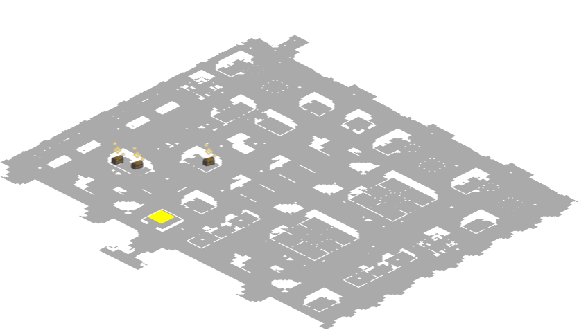
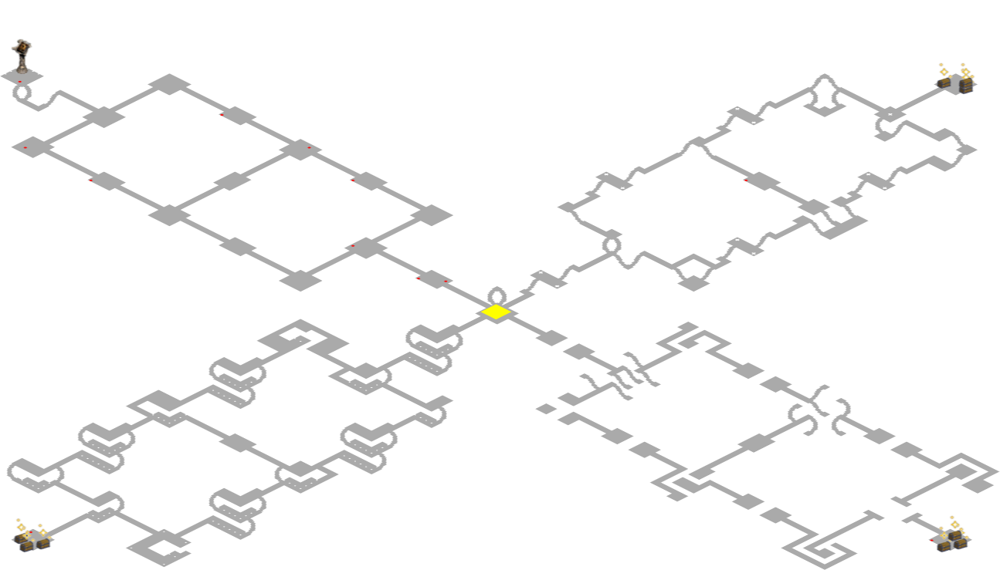

# Diablo 2: Resurrected map viewer

Noob friendly map reveal for Diablo 2 Resurrected.  
This is to be used for educational purposes only!  
Use at your own risk, there is no warranty or responsibility taken for being penalised for using this.  

This repo will fetch the map from a backend map server and display it in the top left corner of your D2R window as shown below:

Lower Kurast

Canyon of the Magi

Arcane Sanctuary

## Usage

1. Download the latest `d2rmap-vx.x.x.exe` and `settings.ini` release files (link to the right).
2. Launch D2R.
3. Run `d2rmap.exe` while in menus or in game.
4. Map should appear at the top left and change as you move through the levels. (It might take a few seconds to first appear)

**Note that this default method uses my hosted map server that I offer out for free.  
This server is getting hammered lately so it would be appreciated if you supported this project with a Bitcoin donation** `18hSn32hChp1CmBYnRdQFyzkz5drpijRa2`  

**Map Legend**

- Purple icon for exits
- Yellow for waypoints
- Red dot for NPC
- Cyan for normal chests  
- Some quest items are marked (stones, altars etc)

**Other notes**

- You can exit the maphack with Shift+F10
- You can also right click the icon in the system tray.
- This MH will automatically exit when you exit D2R.
- Map download might be slow, just give it a second would ya?
- Please consider donating to help support the project (and server costs).

## Run from source

If you don't trust a precompiled executable, you can alternatively download and install <https://www.autohotkey.com/>  
Then you can run `src/d2r-map.ahk` directly from source.
This way you can verify the code yourself and ensure there are no hidden macros.  

Do not accept executables for this from any other source!

## Discord

Join the discord server  <https://discord.gg/qEgqyVW3uj>

Please report any scams or attempts to resell this maphack on discord.

## Donations

Please consider donating some Bitcoin to support this project:  
`18hSn32hChp1CmBYnRdQFyzkz5drpijRa2`  

## Configure

- You can change map size and opacity in `settings.ini`  
- If you want the map to appear on a second display, change the `leftMargin` value in `settings.ini` to be larger than the width of your primary monitor (in pixels). Negative values also work.

## Map Server

### Use the hosted free map server

I offer a free to use map server on the internet, but it may be slow and occasionally go down.  
If you use this server please consider donating to help with server costs.  
If you'd like to donate, some BTC will be appreciated:  
`18hSn32hChp1CmBYnRdQFyzkz5drpijRa2` (or some d2jsp forum gold)

This free server comes preconfigured, simply use the existing configuration in `settings.ini`

### Run your own map server

Alternatively you can host your own map server which I've also shared for free.  
Please refer to [SERVER.md](SERVER.md)

## How it works

This script will run the background and read player data directly from memory once per second.  
It will retrieve the mapseed/level/difficulty and send a request to a mapserver hosted separately.  
This mapserver will return a map image.  
This script will display that map image in the corner as shown in the above screenshot.  

## Is it safe?

No one can say for sure. Blizzard do have Warden anti-cheat that will scan your computer for running processes and compare them against a blacklist. I accept no responsibility for any outcomes or usage of this tool. Use at your own risk!

## Troubleshooting

- A log file `log.txt` is generated in the same folder as the executable.  
- You can also set debug logging to `true` in `settings.ini` for verbose logging.  
- Go to the discord server if you need further help <https://discord.gg/qEgqyVW3uj>  
- Tested and working on Diablo 2 Resurrected `1.0.66878`

## TODO

- Need to add more info for NPCs and others
- Replace coloured blocks with icons
- Option to change the map to a floating window
- Path finding between waypoints/exits?
- Show player location on the map?
- Indicate on the screen which way waypoints/exits are relative to your position?

If you have ideas for more features, feel free to share them on discord