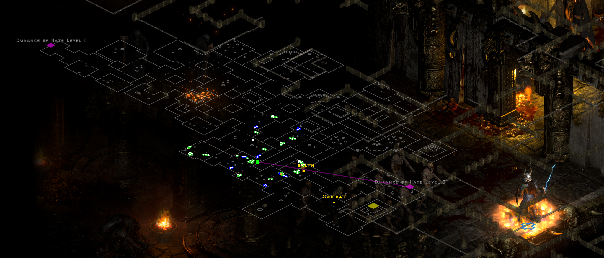
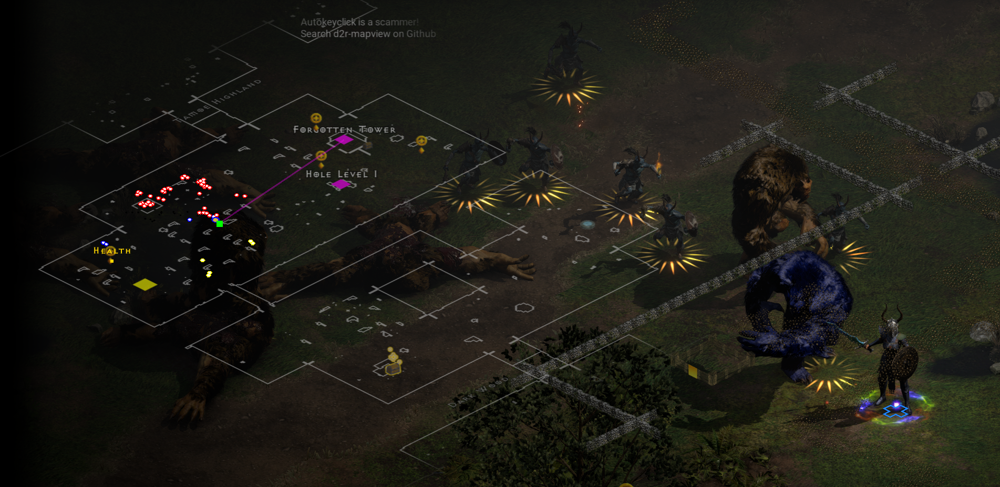
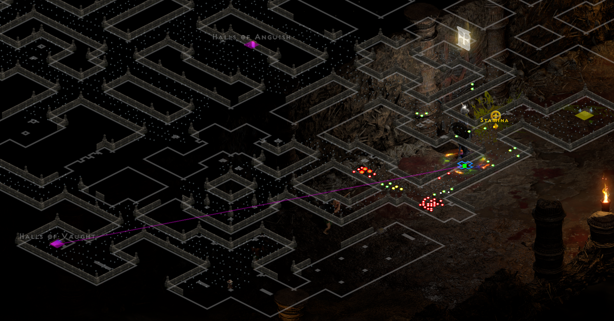
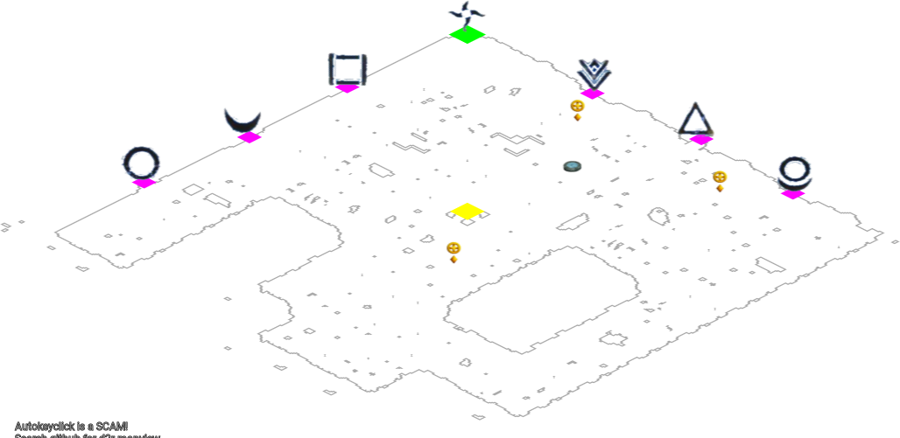
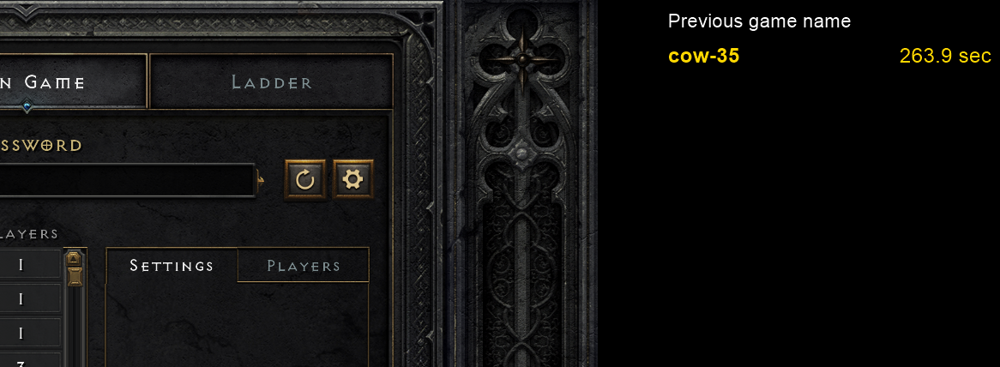

# Diablo 2: Resurrected map viewer

Noob friendly FREE map reveal tool for Diablo 2 Resurrected.  
Use at your own risk, there is no warranty or responsibility taken for being penalised for using this.

Please follow this guide to setup your own, it's quite easy: https://github.com/joffreybesos/d2r-mapview/wiki/Setup-guide

This tool is licenced under GPLv3, reselling this maphack violates the terms of the license.

## Join the discord server <https://discord.gg/qEgqyVW3uj>



## Demonstration

<https://youtu.be/tSDmgh0ceXk>

## Map examples

|     Dark Wood     |    Halls of Pain     |        Travincal         |
| :---------------: | :------------------: | :----------------------: |
|  |  |  |

## Setup

Set up guide has moved to the wiki:
https://github.com/joffreybesos/d2r-mapview/wiki/Setup-guide

Press Ctrl+H in game for a help menu
Press Ctrl+O for in game options

The executable does _not_ require administrator privileges unless you are running the game as administrator. Refer to troubleshooting below if you have issues.  
Sometimes windows defender can intercept the download, try a different browser if this happens.

Please read the wiki https://github.com/joffreybesos/d2r-mapview/wiki/Setup-guide

### Virustotal gave me an alert

The compiled executable will get false positives in virus scans. This is because the tool is written in Autohotkey.
Autohotkey, while a powerful tool, has been used for all sorts of nefarious applications in the past.  
If you look on the Autohotkey forums, you'll see this is a widely reported problem.
On top of that it reads from memory and hooks into hotkeys which flags in virus scanners.

If you still don't trust it, you can run directly from source.
To do so download and install <https://www.autohotkey.com/>  
Then you can simply double click `src/d2r-map.ahk` to run from source code.
This way you can be fully aware of what code you're executing and you don't have to trust an opaque executable.

Do not accept executables for this from any other source!

## Features

- The map will show positions of:
  - Players
  - Monsters as a white dot
  - Unique/champion/superunique monsters as a larger gold dot
  - Monster immunities
  - Item drop alerts with a customisable filter
  - Text to speech to announce dropped special items defined in your item filter
  - Shows shrines and their type
  - Portals
  - All doors and waypoints marked
  - A purple line drawn to the next level exit
  - A yellow line drawn to the waypoint
  - A red line drawn to the nearest boss (Nihlithak, summoner etc)
  - All quest items, marked in green (Stones, Hellforge, Altars etc)
- Can have map in corner of the screen or in the center like the normal automap
- Saves game session history including game names, xp gained, duration into a CSV
- Shows server IP in the corner of the window
- Displays game history in game menu:
  
- Highly configurable, size, color, position, opacity etc
- Can change map size and position with key shortcuts while in game

**Other notes**

- Press `Ctrl+H` to see help in game, including a map legend
- Press `Ctrl+O` for in game options
- Press `/` (the one next to your shift key) to switch map to centered mode.
- You can exit the maphack with `Shift+F10`
- You can also right click the icon in the system tray.
- This MH will automatically exit when you exit D2R.

## Discord

Join the discord server <https://discord.gg/qEgqyVW3uj>
Please report any scams or attempts to resell this maphack on discord.

## Donations

Please consider donating either some BTC or D2JSP to support this project.

Bitcoin donation `18hSn32hChp1CmBYnRdQFyzkz5drpijRa2`  
BEP20 BUSD address `0xb77638fec7fb7ac2064f5fc754980404835fe9a3`  
D2JSP forum gold: <https://forums.d2jsp.org/user.php?i=1294529>

### Configure

In `settings.ini` you can declare any of the below settings to override the built-in default setting.

e.g. to turn off immunities add the following line in `settings.ini`:

```
showImmunities=false
```

#### General settings

| Setting           | Default                 | Description                                                                                                                                                                              |
| :---------------- | :---------------------- | :--------------------------------------------------------------------------------------------------------------------------------------------------------------------------------------- |
| baseUrl           | <http://localhost:3002> | URL of the map server, set to public server by default, but you can use localhost if you [run your own server](https://github.com/joffreybesos/d2-mapserver/blob/master/INSTALLATION.md) |
| scale             | 1                       | The global scale setting applied to all map images, press NumpadPlus and NumpadSubtract to adjust in game                                                                                |
| leftMargin        | 20                      | The left margin of all map images, set this to wider than your primary monitor to push it onto your secondary monitor.                                                                   |
| topMargin         | 20                      | Top margin of map image                                                                                                                                                                  |
| opacity           | 0.6                     | How transparent the map image should be, between 0 and 1                                                                                                                                 |
| alwaysShowMap     | false                   | This setting will force the map to always show, ignoring the TAB key                                                                                                                     |
| hideTown          | false                   | This will hide town maps so they will never show                                                                                                                                         |
| edges             | true                    | This makes map images appear as walls instead of walkable area                                                                                                                           |
| wallThickness     | 0.5                     | Thickness of walls in when `edges` is turned on                                                                                                                                          |
| centerMode        | false                   | (BETA) centerMode will replace the normal automap, the map will be scaled really large and track the player position                                                                     |
| centerModeScale   | 1.7                     | scale of the image, change this if the scale in centered mode doesn't line up                                                                                                            |
| serverScale       | 4                       | The larger the scale, the more detailed the map, but slower to load                                                                                                                      |
| centerModeOpacity | 0.7                     | Opacity of the centered map                                                                                                                                                              |
| centerModeXoffset | 0                       | Change this if the map doesn't line up with the normal automap horizontally                                                                                                              |
| centerModeYoffset | -56                     | Change this if the map doesn't line up with the normal automap vertically                                                                                                                |
| centerModeXUnitoffset | 1                       | Change this if the units (players, monsters etc) doesn't line up horizontally with the normal automap                                                                                    |
| centerModeYUnitoffset | 16                      | Change this if the units (players, monsters etc) doesn't line up vertically with the normal automap                                                                                      |

#### Game History/info

| Setting          | Default | Description                                                                                |
| :--------------- | :------ | :----------------------------------------------------------------------------------------- |
| showGameInfo     | true    | Show/hide game history in menus                                                            |
| textSectionWidth | 700     | How many pixels of width to allow to show game history, make smaller to take up less width |
| textSize         | 20      | Text size of game history                                                                  |
| textAlignment    | LEFT    | can also set RIGHT to move game history to other side of the screen                        |
| showAllHistory   | false   | show ALL game history even in previous gaming sessions in game shitory list                |
| showIPtext       | true    | Show game server IP address in corner of game window                                       |
| textIPfontSize   | 18      | IP address font size                                                                       |
| textIPalignment  | RIGHT   | can also set to LEFT to move IP address to left side of screen                             |

#### Monsters

| Setting            | Default | Description                                                             |
| :----------------- | :------ | :---------------------------------------------------------------------- |
| showNormalMobs     | true    | Set to false to hide normal non-unique monsters on the map              |
| showUniqueMobs     | true    | Set to false to hide unique monsters on the map                         |
| showBosses         | true    | Show bosses with a red dot, such as Diablo, Summoner etc                |
| showDeadMobs       | true    | Show dead mobs as a black square (useful to know which areas are clear) |
| normalDotSize      | 2.5     | Dot size of a normal mob                                                |
| normalImmunitySize | 4       | Size of the larger immunity circle that surrounds a normal mob dot      |
| uniqueDotSize      | 5       | Dot size of a unique mob                                                |
| uniqueImmunitySize | 11      | Size of the larger immunity circle that surrounds a unique mob dot      |
| deadDotSize        | 2       | Size of dead mob                                                        |
| bossDotSize        | 5       | Size of boss dot                                                        |
| normalMobColor     | FFFFF   | Colour of the dot of normal monsters                                    |
| uniqueMobColor     | D4AF37  | Colour of the dot of unique monsters                                    |
| bossColor          | FF0000  | Colour of boss dots on the map                                          |
| deadColor          | 000000  | Color of dead mobs on the map                                           |

#### Immunities

| Setting             | Default | Description                                  |
| :------------------ | :------ | :------------------------------------------- |
| showImmunities      | true    | Show immunties of normal and unique monsters |
| physicalImmuneColor | CD853f  | How physical immunity will display           |
| magicImmuneColor    | ff8800  | How magic immunity will display              |
| fireImmuneColor     | FF0000  | How fire immunity will display               |
| lightImmuneColor    | FFFF00  | How lightning immunity will display          |
| coldImmuneColor     | 0000FF  | How coldimmunity will display                |
| poisonImmuneColor   | 32CD32  | How poison immunity will display             |

#### Missiles/projectiles

| Setting             | Default | Description                                      |
| :------------------ | :------ | :----------------------------------------------- |
| showPlayerMissiles  | true    | Player missiles/projectiles will display         |
| showEnemyMissiles   | true    | Enemy missiles/projectiles will display          |
| missileOpacity      | 0x77    | The opacity of the missiles, must be a hex value |
| missileMajorDotSize | 4       | The larger missiles have a larger dot            |
| missileMinorDotSize | 2       | The smaller missiles have a smaller dot          |

#### Other players/shrines/portals on map

| Setting              | Default | Description                                       |
| :------------------- | :------ | :------------------------------------------------ |
| showPlayerDotCenter  | true    | Center mode only, shows current player green dot  |
| showOtherPlayers     | true    | Show other players as squares                     |
| showOtherPlayerNames | false   | Show names above player dots, disabled by default |
| showShrines          | true    | Show shrines                                      |
| showPortals          | true    | Show portals including red portals                |
| portalColor          | 00AAFF  | Town portal color                                 |
| redPortalColor       | FF0000  | Red portal color (e.g. cow level portal)          |
| shrineColor          | FFD700  | Shrine and shrine type text colour                |
| shrineTextSize       | 14      | Shrine text size                                  |

#### Dropped valuable item alerts

| Setting           | Default | Description                                              |
| :---------------- | :------ | :------------------------------------------------------- |
| showUniqueAlerts  | true    | Show an alert when a unique item is on the ground        |
| showSetItemAlerts | true    | Show an alert when a set item is on the ground           |
| showRuneAlerts    | true    | Show an alert when a rune is on the ground               |
| showJewelAlerts   | true    | Show an alert when a jewel is on the ground              |
| showCharmAlerts   | true    | Show an alert when a charm is on the ground              |
| showBaseItems     | true    | Show an alert when a base item is on the ground          |
| runeItemColor     | FFa700  | Rune alert colour when a rune is on the ground           |
| uniqueItemColor   | BBA45B  | Unique alert color when a unique is on the ground        |
| setItemColor      | 00FC00  | Set item alert colour when a set item is on the ground   |
| charmItemColor    | 6D6DFF  | Charm alert colour when a charm is on the ground         |
| jewelItemColor    | 6D6DFF  | Jewel alert colour when a jewel is on the ground         |
| baseItemColor     | AAAAAA  | Base item alert colour when a base item is on the ground |

#### Text to speech

| Setting             | Default | Description                                                             |
| :------------------ | :------ | :---------------------------------------------------------------------- |
| allowTextToSpeech   | true    | Toggle whether an item of interest is announced in speech when it drops |
| textToSpeechVolume  | 50      | Range 1-100 - Volume of text to speech                                  |
| textToSpeechPitch   | 1       | Voice pitch                                                             |
| textToSpeechSpeed   | 1       | Speaking speed                                                          |
| allowItemDropSounds | true    | Toggle sound effects in itemfilter.yaml                                 |

#### Guide lines

| Setting          | Default | Description                                                          |
| :--------------- | :------ | :------------------------------------------------------------------- |
| showWaypointLine | false   | Draws a yellow line to the nearest waypoint, turned off by default   |
| showNextExitLine | true    | Draws a purple line to the next relevant exit                        |
| showBossLine     | true    | Draws a red line to the boss in that level (Nihlithak, Summoner etc) |
| showQuestLine    | true    | Draws a green line to the relevant quest item in that level          |

#### Shortcut keys

It's a good idea to add `~` in front of the hotkey. This is to make the key still send the normal keystroke as well as trigger the MH function.

| Setting            | Default    | Description                                        |
| :----------------- | :--------- | :------------------------------------------------- |
| increaseMapSizeKey | NumpadAdd  | Key to increase the size of the map                |
| decreaseMapSizeKey | NumpadSub  | Key to decrease the size of the map                |
| alwaysShowKey      | NumpadMult | Key to toggle `alwaysShowMap` setting              |
| moveMapLeft        | #Left      | Shortcut to move map left (Win + left)             |
| moveMapRight       | #Right     | Shortcut to move map right (Win + Right)           |
| moveMapUp          | #Up        | Shortcut to move map up (Win + Up)                 |
| moveMapDown        | #Down      | Shortcut to move map down (Win + Down)             |
| switchMapMode      | /          | Shortcut to toggle centered map mode (not Numpad/) |
| historyToggleKey   | ^g         | Shortcut key to hide game history in menu (Ctrl+G) |

To better understand the keyboard shortcut format, refer to <https://www.autohotkey.com/docs/KeyList.htm#modifier>

#### Advanced

| Setting         | Default  | Description                                                                                                                                                                                                                                                             |
| :-------------- | :------- | :---------------------------------------------------------------------------------------------------------------------------------------------------------------------------------------------------------------------------------------------------------------------- |
| performanceMode | 50ms        | Experimental, set to `-1` to max out performance. This may use too much CPU and cause strange behaviour. Try setting to `0` if it uses too much CPU. Refer to this [doc](https://www.autohotkey.com/docs/commands/SetBatchLines.htm) to understand what it's doing |
| enableD2ML      | false    | Only enable if you use multiple D2R sessions                                                                                                                                                                                                                            |
| windowTitle     | D2R:main | This is ignored unless `enableD2ML` is turned on. It is the window title of one D2R session for multi sesion                                                                                                                                                            |

#### Debugging

| Setting | Default | Description                                                                                                                        |
| :------ | :------ | :--------------------------------------------------------------------------------------------------------------------------------- |
| debug   | false   | Turn this one to increase the level of the logging, note this will create huge log.txt files. Can be toggled in-game with Shift+F9 |

## Map Server

### Use the hosted free map server

I offer a free to use map server but it is shutting down Feb 14.
Please run your own, it's very easy and I've created this guide: [INSTALLATION.md](https://github.com/joffreybesos/d2-mapserver/blob/master/INSTALLATION.md)

## Is it safe?

No one can say for sure. Blizzard do have Warden anti-cheat that will scan your computer for running processes and compare them against a blacklist. I accept no responsibility for any outcomes or usage of this tool. Use at your own risk!

## Troubleshooting

Refer to <https://github.com/joffreybesos/d2r-mapview/wiki/Setup-guide#troubleshooting>  

## Licence

This repo is licenced under GPLv3

1. Anyone can copy, modify and distribute this software.
2. You have to include the license and copyright notice with each and every distribution.
3. You can use this software privately.
4. You can use this software for commercial purposes.
5. Any modifications of this code base MUST be distributed with the same license, GPLv3.
6. This software is provided without warranty.
7. The software author or license can not be held liable for any damages inflicted by the software.

Violations of the licence may make you liable for DMCA takedowns.

## Kudos

- @blacha and his [Diablo 2 map package](https://github.com/blacha/diablo2/tree/master/packages/map)
- @OneXDeveloper and others at [MapAssist](https://github.com/OneXDeveloper/MapAssist)
- @noah- and [d2bs project](https://github.com/noah-/d2bs/blob/master/D2Structs.h)
